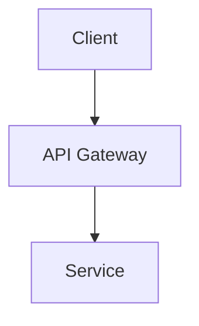

# Diagrams

This directory contains Mermaid diagram source files that can be embedded directly in markdown documentation.

## Diagram Files

- `platform.mmd` - Platform architecture diagram
- `deployment.mmd` - Deployment architecture diagram
- `database.mmd` - Database architecture diagram

## Usage

Mermaid diagrams can be embedded directly in markdown files using code blocks:

````markdown

````

GitHub Pages and GitHub markdown renderer support Mermaid diagrams natively.

## Creating Diagrams

You can create and edit Mermaid diagrams using:
- [Mermaid Live Editor](https://mermaid.live/)
- VS Code with Mermaid extension
- Any text editor (Mermaid syntax)
