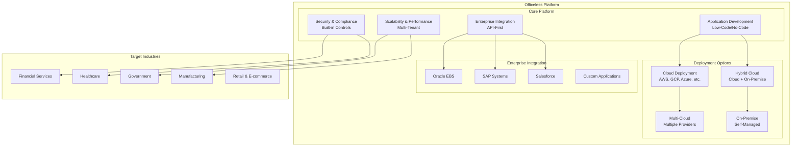

# Overview

## Introduction

This document provides a high-level overview of the Officeless platform, its core concepts, capabilities, and positioning in enterprise environments.

## Platform Overview

View Mermaid source code

## Platform Vision

Officeless is designed to enable organizations to build custom applications tailored to their specific business needs while maintaining enterprise-grade security, scalability, and compliance requirements.

## Core Capabilities

### Application Development
- Custom application development framework
- Low-code/no-code capabilities for rapid development
- Extensible architecture for complex requirements

### Enterprise Integration
- Pre-built connectors for common enterprise systems
- API-first architecture
- Event-driven integration patterns

### Security and Compliance
- Built-in security controls
- Compliance framework support
- Audit and governance capabilities

### Scalability and Performance
- Horizontal scaling capabilities
- Multi-tenant architecture
- Performance optimization features

## Key Differentiators

1. **Cloud-Agnostic** - Deployable across major cloud providers and on-premises
2. **Enterprise-Ready** - Security, compliance, and governance built-in
3. **Extensible** - Customizable to meet specific business requirements
4. **Hybrid-Capable** - Supports hybrid and multi-cloud deployments

## Use Cases

- Enterprise application development
- Digital transformation initiatives
- Legacy system modernization
- Multi-tenant SaaS platforms
- Regulated industry applications (banking, healthcare, government)

## Target Industries

- Financial Services
- Healthcare
- Government and Public Sector
- Manufacturing
- Retail and E-commerce

## Next Steps

- [Platform Architecture](./02-platform-architecture.html) - Detailed system design
- [Deployment Architecture](./03-deployment-architecture.html) - Infrastructure patterns
- [Security and Governance](./05-security-and-governance.html) - Security controls
