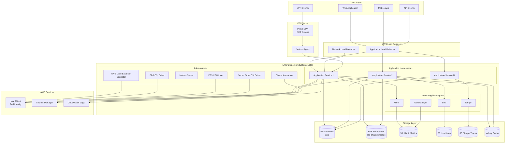

# Platform Architecture

## Architecture Overview

This document describes the high-level architecture of the Officeless platform, including system components, architectural patterns, and design principles. The platform is deployed on AWS using Amazon EKS (Elastic Kubernetes Service) as the container orchestration platform.

## Platform Architecture Diagram

View Mermaid source code

## Infrastructure Foundation

### AWS EKS Cluster
- **Cluster Name**: `production-cluster`
- **Kubernetes Version**: 1.33
- **Region**: AWS region (e.g., us-east-1)
- **Endpoint Configuration**:
  - Private endpoint access: Enabled
  - Public endpoint access: Disabled (production security best practice)
  - Authentication mode: CONFIG_MAP
- **Cluster Logging**: Enabled for API, audit, authenticator, controller manager, and scheduler logs
- **Log Retention**: 7 days in CloudWatch

### Compute Nodes
- **Node Group**: `worker-nodes`
- **Instance Types**: 
  - Primary: `t3.xlarge` (4 vCPU, 16 GB RAM)
  - Alternative: `m6i.large` (2 vCPU, 8 GB RAM)
- **AMI Type**: Bottlerocket (AWS-optimized Linux for containers)
- **Capacity Type**: ON_DEMAND
- **Disk Size**: 200 GB per node
- **Scaling Configuration**:
  - Minimum: 3 nodes
  - Desired: 3 nodes
  - Maximum: 6 nodes
- **Update Strategy**: Max unavailable = 1 (rolling updates)

## System Components

### Core Platform Services

#### Application Runtime
- **Container Orchestration**: Amazon EKS (Kubernetes 1.33)
- **Container Runtime**: Containerd (via Bottlerocket)
- **Multi-tenant isolation**: Kubernetes namespaces and RBAC
- **Resource management**: Kubernetes resource quotas and limits

#### Load Balancing and Ingress
- **AWS Load Balancer Controller**: v1.12.0 (Helm chart)
- **Load Balancer Types**:
  - Application Load Balancer (ALB) for HTTP/HTTPS
  - Network Load Balancer (NLB) for TCP/UDP
- **Ingress**: Kubernetes Ingress resources with AWS ALB integration
- **Subnet Tagging**: Public and private subnets tagged for ELB placement

#### Data Services
- **Block Storage**: AWS EBS CSI Driver (v1.42.0-eksbuild.1)
  - Storage class: gp3 (provisioned)
  - Volume binding: WaitForFirstConsumer
  - Volume expansion: Enabled
- **File Storage**: AWS EFS CSI Driver (v3.1.8)
  - Storage class: efs
  - Provisioning mode: EFS Access Points
  - Encryption: Enabled at rest
  - Performance mode: General Purpose
  - Throughput mode: Bursting
- **Object Storage**: Amazon S3 buckets for:
  - Application data
  - Monitoring data (Mimir, Loki, Tempo)
  - Backup and archival
- **Caching**: Valkey (Redis-compatible) via ElastiCache module

#### Integration Services
- **VPN Access**: EC2-based VPN server (Pritunl)
- **CI/CD Integration**: Jenkins agent on VPN instance
- **Container Registry**: Docker registry support

### Supporting Services

#### Identity and Access Management
- **AWS IAM Integration**: 
  - EKS Pod Identity (v1.3.5-eksbuild.2) for service account to IAM role mapping
  - OIDC Provider integration for IRSA (IAM Roles for Service Accounts)
- **Kubernetes RBAC**: Role-based access control
- **Service Accounts**: Per-namespace service accounts with IAM role associations

#### Configuration Management
- **Kubernetes ConfigMaps**: Environment configuration
- **Kubernetes Secrets**: Application secrets
- **AWS Secrets Manager**: External secrets via Secret Store CSI Driver
- **Pod Identity**: EKS Pod Identity for secure AWS service access

#### Monitoring and Observability
- **Metrics**: Metrics Server for Kubernetes metrics
- **Logging**: 
  - CloudWatch Log Groups for EKS cluster logs
  - Loki for application logs (S3-backed)
- **Tracing**: Tempo for distributed tracing (S3-backed)
- **Metrics Storage**: Mimir for long-term metrics storage (S3-backed)
- **Alerting**: Alertmanager (S3-backed)
- **S3 Buckets for Observability**:
  - `mimir-metrics` - Metrics storage
  - `mimir-alertmanager` - Alertmanager state
  - `mimir-ruler` - Recording rules
  - `loki-chunks` - Log chunks
  - `loki-ruler` - Log rules
  - `tempo-traces` - Trace storage

#### Auto-Scaling
- **Cluster Autoscaler**: v9.45.0 (Helm chart)
  - Auto-discovery of node groups
  - Scale based on pod scheduling requirements
  - Integration with AWS Auto Scaling Groups

## Architectural Patterns

### Microservices Architecture
- Service decomposition by business capability
- Independent deployment and scaling via Kubernetes Deployments
- Service-to-service communication via Kubernetes Services
- Service mesh ready (can be added)

### Event-Driven Architecture
- Asynchronous event processing via message queues
- Event sourcing capabilities
- Pub/sub messaging patterns

### API-First Design
- RESTful APIs
- GraphQL support (application-level)
- OpenAPI/Swagger specifications

### Multi-Tenancy
- Kubernetes namespace-based tenant isolation
- Resource quotas per namespace
- Network policies for network isolation
- RBAC for access control

## Design Principles

1. **Scalability** - Horizontal pod autoscaling and cluster autoscaling
2. **Resilience** - Multi-AZ deployment, pod disruption budgets, health checks
3. **Security** - Private endpoints, IAM integration, encryption at rest and in transit
4. **Observability** - Comprehensive logging, metrics, and tracing
5. **Extensibility** - Helm charts, Kubernetes operators, CSI drivers

## Technology Stack

### Runtime
- **Container Orchestration**: Amazon EKS (Kubernetes 1.33)
- **Container OS**: Bottlerocket (AWS-optimized)
- **Service Mesh**: Optional (can be added)
- **API Gateway**: AWS Application Load Balancer via AWS Load Balancer Controller

### Data Layer
- **Block Storage**: AWS EBS (gp3 volumes via EBS CSI Driver)
- **File Storage**: AWS EFS (via EFS CSI Driver)
- **Object Storage**: Amazon S3
- **Caching**: Valkey (Redis-compatible) via ElastiCache
- **Message Queues**: Application-level (can integrate with SQS, SNS)

### Integration
- **REST APIs**: Kubernetes-native services
- **GraphQL**: Application-level
- **Message Brokers**: Application-level integration
- **Event Streaming**: Application-level

### Networking
- **VPC**: Custom VPC with public and private subnets
- **Load Balancing**: AWS Application/Network Load Balancers
- **VPN**: EC2-based Pritunl VPN server
- **DNS**: Route 53 (AWS managed)

## Deployment Models

- **Primary**: AWS EKS in selected AWS region
- **Network**: VPC-based with private subnets for workloads
- **Hybrid Capable**: VPN server for on-premises connectivity
- **Multi-cloud Ready**: Architecture supports extension to other clouds

## Related Documentation

- [Deployment Architecture](./03-deployment-architecture.html)
- [Database and Storage](./04-database-and-storage.html)
- [Extensibility](./08-extensibility.html)
