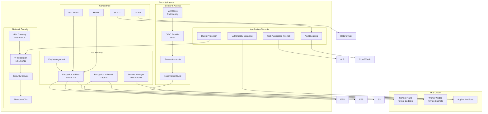

# Security and Governance

## Security Overview

This document describes the security controls, compliance frameworks, and governance models implemented in the Officeless platform.

## Security Architecture Diagram

View Mermaid source code

View Mermaid source code

## Security Architecture

### Defense in Depth
- Multiple layers of security controls
- Network security
- Application security
- Data security

### Zero Trust Model
- Never trust, always verify
- Least privilege access
- Continuous verification

## Authentication and Authorization

### EKS Cluster Authentication
- **Authentication Mode**: CONFIG_MAP
- **Bootstrap Cluster Creator**: Admin permissions enabled
- **Endpoint Access**:
  - Private endpoint: Enabled (from VPC CIDR only)
  - Public endpoint: Disabled (production security best practice)
- **Access Control**: Kubernetes RBAC

### AWS IAM Integration

#### EKS Pod Identity
- **Add-on**: eks-pod-identity-agent v1.3.5-eksbuild.2
- **Purpose**: Secure AWS service access from Kubernetes pods
- **Mechanism**: Service account to IAM role mapping
- **Benefits**: No need for AWS access keys in pods

#### OIDC Provider
- **Integration**: AWS IAM OIDC Identity Provider
- **Use Cases**: 
  - IRSA (IAM Roles for Service Accounts)
  - EFS CSI Driver authentication
  - Secret Store CSI Driver authentication
  - AWS Load Balancer Controller
  - Custom application IAM roles

#### IAM Roles for Service Accounts
- **EBS CSI Driver**: Dedicated IAM role with EBS permissions
- **EFS CSI Driver**: Dedicated IAM role with EFS permissions
- **Secret Store CSI Driver**: Dedicated IAM role with Secrets Manager permissions
- **AWS Load Balancer Controller**: Dedicated IAM role with ELB permissions
- **Monitoring Services**: Dedicated IAM role with S3 permissions
- **Application Services**: Custom IAM roles per namespace/service account

### Kubernetes RBAC
- **Role-Based Access Control**: Enabled
- **Service Accounts**: Per-namespace service accounts
- **Cluster Roles**: System and custom cluster roles
- **Role Bindings**: Namespace-scoped and cluster-scoped

### Authentication Methods (Application Level)
- Username/password
- Multi-factor authentication (MFA)
- Single sign-on (SSO)
- OAuth 2.0 / OpenID Connect
- Certificate-based authentication
- API keys and tokens

### Authorization Models
- **Kubernetes RBAC**: Role-based access control
- **AWS IAM**: Policy-based access control
- **Application-Level**: Custom authorization logic
- **Fine-grained Permissions**: Per-resource access control

### Identity Management
- **Kubernetes Users**: Managed via kubeconfig
- **Service Accounts**: Kubernetes-native service identity
- **AWS IAM**: Cloud resource access
- **Identity Federation**: OIDC-based federation

## Network Security

### VPC Security
- **VPC Isolation**: Dedicated VPC (10.1.0.0/16)
- **DNS**: 
  - DNS support: Enabled
  - DNS hostnames: Enabled
- **Flow Logs**: Can be enabled for network monitoring

### Network Segmentation
- **Public Subnets**: Internet-facing resources (NAT, ALB)
- **Private Subnets**: Application workloads, EKS nodes
- **Subnet Isolation**: Security groups enforce network policies
- **Route Tables**: Separate routing for public and private subnets

### Security Groups

#### EKS Cluster Security Group
- **Name**: `{cluster-name}-cluster-sg`
- **Ingress Rules**:
  - Port 443 (HTTPS) from VPC CIDR (10.1.0.0/16)
- **Egress Rules**:
  - All outbound traffic (0.0.0.0/0)
- **Purpose**: Control plane access control

#### Node Security Groups
- Managed by EKS
- Allows communication between nodes and pods
- Restricts unnecessary ingress

#### Application Security Groups
- Custom security groups per application
- Least privilege access
- Port-specific rules

### Network Encryption
- **TLS/SSL**: All HTTPS traffic encrypted
- **VPN**: Pritunl VPN server for secure remote access
- **Private Connectivity**: VPC-based private networking
- **Direct Connect**: Can be added for hybrid connectivity

### VPN Security
- **VPN Server**: EC2 instance with Pritunl
- **Protocols**: OpenVPN, WireGuard
- **Encryption**: Strong encryption for VPN tunnels
- **Access Control**: User-based authentication
- **Network Isolation**: VPN users in separate network segment

### DDoS Protection
- Rate limiting
- Traffic filtering
- DDoS mitigation services

## Application Security

### Secure Development
- Secure coding practices
- Code review processes
- Static application security testing (SAST)
- Dynamic application security testing (DAST)

### API Security
- API authentication
- Rate limiting
- Input validation
- Output encoding

### Dependency Management
- Dependency scanning
- Vulnerability management
- Patch management

## Data Security

### Encryption
- Encryption at rest
- Encryption in transit
- Key management
- Key rotation policies

### Data Protection
- Data classification
- Data masking
- Data loss prevention (DLP)
- Backup encryption

### Access Controls
- Database access controls
- File system permissions
- Audit logging

## Compliance and Governance

### Compliance Frameworks
- ISO 27001
- SOC 2
- GDPR
- HIPAA (healthcare)
- PCI DSS (payment processing)
- Industry-specific regulations

### Governance Models
- Policy management
- Compliance monitoring
- Risk management
- Audit and reporting

### Data Privacy
- Privacy by design
- Data minimization
- Consent management
- Right to erasure

## Security Monitoring

### Security Information and Event Management (SIEM)
- Log aggregation
- Event correlation
- Threat detection
- Incident response

### Vulnerability Management
- Vulnerability scanning
- Penetration testing
- Security assessments
- Remediation tracking

### Incident Response
- Incident detection
- Response procedures
- Forensics
- Post-incident review

## Audit and Logging

### Audit Logging
- Authentication events
- Authorization decisions
- Data access
- Configuration changes

### Log Management
- Centralized logging
- Log retention policies
- Log analysis
- Compliance reporting

## Security Best Practices

### Configuration Management
- Secure defaults
- Configuration hardening
- Secrets management
- Environment separation

### Patch Management
- Vulnerability patching
- Update procedures
- Testing processes
- Rollback capabilities

### Security Training
- Developer training
- Security awareness
- Incident response training

## Third-Party Security

### Vendor Management
- Security assessments
- Contract requirements
- Ongoing monitoring

### Supply Chain Security
- Dependency scanning
- Software composition analysis
- Secure software development lifecycle (SSDLC)

## Related Documentation

- [Platform Architecture](./02-platform-architecture.md)
- [Observability](./06-observability.md)
- [Enterprise Integration](./09-enterprise-integration.md)
