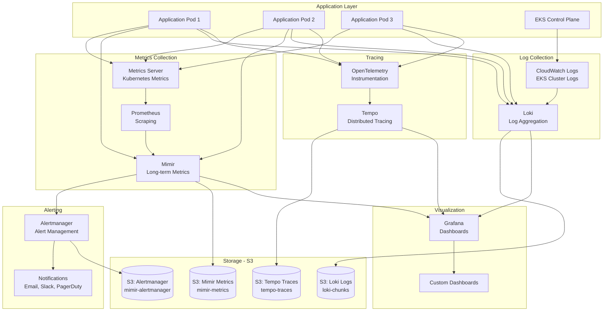

# Observability

## Observability Overview

This document describes the observability strategy for the Officeless platform, including monitoring, logging, tracing, and operational visibility capabilities. The platform uses a comprehensive observability stack with Mimir for metrics, Loki for logs, and Tempo for traces, all backed by Amazon S3.

## Observability Stack Architecture

View Mermaid source code

## Observability Stack

### Metrics: Mimir
- **Storage Backend**: Amazon S3
- **S3 Buckets**:
  - `mimir-metrics` - Metrics storage
  - `mimir-alertmanager` - Alertmanager state
  - `mimir-ruler` - Recording and alerting rules
- **Features**:
  - Long-term metrics storage
  - Prometheus-compatible
  - Horizontal scaling
  - High availability

### Logs: Loki
- **Storage Backend**: Amazon S3
- **S3 Buckets**:
  - `loki-chunks` - Log chunks
  - `loki-ruler` - Log rules
- **Features**:
  - Log aggregation
  - Label-based indexing
  - PromQL-compatible queries
  - S3-backed storage

### Traces: Tempo
- **Storage Backend**: Amazon S3
- **S3 Bucket**: `tempo-traces`
- **Features**:
  - Distributed tracing
  - OpenTelemetry compatible
  - Object storage backend
  - High scalability

### Access Management
- **IAM Role**: `monitoring-role`
- **Service Account**: `monitoring-sa`
- **Namespace**: `monitoring`
- **Permissions**:
  - S3 read/write access to monitoring buckets
  - Pod Identity association for secure access

## Observability Pillars

### Metrics
- **Kubernetes Metrics**: Metrics Server for cluster metrics
- **Application Metrics**: Prometheus-compatible metrics
- **Infrastructure Metrics**: AWS CloudWatch integration
- **Custom Metrics**: Application-defined metrics
- **Storage**: Mimir with S3 backend

### Logs
- **Application Logs**: Collected via Loki
- **System Logs**: EKS cluster logs in CloudWatch
- **Access Logs**: Application-level logging
- **Audit Logs**: Kubernetes audit logs (enabled)
- **Storage**: Loki with S3 backend

### Traces
- **Distributed Tracing**: Tempo for trace collection
- **Request Flow Tracking**: End-to-end request tracing
- **Service Dependencies**: Service map generation
- **Performance Analysis**: Latency and bottleneck identification
- **Storage**: Tempo with S3 backend

## Metrics Collection

### Kubernetes Metrics Server
- **Version**: Latest (via Helm)
- **Namespace**: kube-system
- **Purpose**: Provides CPU and memory metrics for HPA and cluster autoscaler
- **Metrics**:
  - Node CPU and memory
  - Pod CPU and memory
  - Resource requests and limits

### Application Metrics
- **Format**: Prometheus exposition format
- **Collection**: Prometheus or Mimir scraper
- **Metrics Types**:
  - Request rates
  - Response times
  - Error rates
  - Business KPIs
  - Custom application metrics

### Infrastructure Metrics
- **AWS CloudWatch**: 
  - EKS cluster metrics
  - Node metrics
  - EBS volume metrics
  - EFS metrics
  - Load balancer metrics
- **Kubernetes Metrics**:
  - CPU utilization
  - Memory usage
  - Disk I/O
  - Network traffic

### Custom Metrics
- **Business Events**: Application-defined events
- **User Actions**: User activity tracking
- **Feature Usage**: Feature adoption metrics
- **Performance Indicators**: Custom performance metrics

### Metrics Storage
- **Backend**: Mimir with S3 storage
- **Retention**: Configurable (long-term storage)
- **Query**: PromQL-compatible
- **Aggregation**: Automatic metric aggregation
- **High Availability**: Multi-instance deployment

## Logging

### Log Levels
- DEBUG - Detailed diagnostic information
- INFO - General informational messages
- WARN - Warning messages
- ERROR - Error conditions
- FATAL - Critical failures

### Log Aggregation
- Centralized log collection
- Log parsing and indexing
- Full-text search
- Log correlation

### Structured Logging
- JSON format
- Consistent schema
- Contextual information
- Correlation IDs

### Log Retention
- Retention policies
- Archival strategies
- Compliance requirements
- Cost optimization

## Distributed Tracing

### Trace Collection
- Instrumentation
- Trace sampling
- Context propagation
- Trace correlation

### Trace Analysis
- Service dependency mapping
- Latency analysis
- Error identification
- Performance bottlenecks

### Trace Visualization
- Service maps
- Timeline views
- Flame graphs
- Trace comparison

## Alerting

### Alert Types
- Threshold-based alerts
- Anomaly detection
- Composite alerts
- Business alerts

### Alert Channels
- Email notifications
- SMS alerts
- Slack/Teams integration
- PagerDuty integration
- Custom webhooks

### Alert Management
- Alert routing
- Escalation policies
- Alert grouping
- Alert suppression

## Dashboards

### Operational Dashboards
- System health
- Service status
- Resource utilization
- Error rates

### Business Dashboards
- User activity
- Business metrics
- Feature adoption
- Performance SLAs

### Custom Dashboards
- Role-specific views
- Custom visualizations
- Real-time updates
- Historical trends

## APM (Application Performance Monitoring)

### Performance Monitoring
- Response time tracking
- Throughput measurement
- Resource consumption
- Database query performance

### Code Profiling
- CPU profiling
- Memory profiling
- I/O profiling
- Hot spot identification

### Real User Monitoring (RUM)
- Browser performance
- User experience metrics
- Geographic performance
- Device performance

## Infrastructure Monitoring

### Cloud Provider Monitoring
- CloudWatch (AWS)
- Cloud Monitoring (GCP)
- Azure Monitor
- Native integrations

### Container Monitoring
- Kubernetes metrics
- Container health
- Pod status
- Resource quotas

### Network Monitoring
- Network latency
- Bandwidth utilization
- Connection errors
- DNS resolution

## Synthetic Monitoring

### Uptime Monitoring
- Health check endpoints
- Availability tracking
- Response time monitoring
- Geographic checks

### Transaction Monitoring
- Critical user journeys
- API endpoint monitoring
- Multi-step transactions
- Performance baselines

## Cost Monitoring

### Resource Cost Tracking
- Compute costs
- Storage costs
- Network costs
- Third-party service costs

### Cost Optimization
- Cost allocation
- Cost alerts
- Resource right-sizing
- Cost reporting

## Compliance and Audit

### Audit Logging
- Access logs
- Configuration changes
- Security events
- Compliance reporting

### Retention and Archival
- Compliance retention
- Long-term archival
- Search capabilities
- Legal hold

## Best Practices

### Instrumentation
- Comprehensive coverage
- Minimal performance impact
- Consistent patterns
- Documentation

### Data Management
- Data retention policies
- Cost optimization
- Privacy compliance
- Data anonymization

### Incident Response
- On-call procedures
- Runbooks
- Post-mortem analysis
- Continuous improvement

## Related Documentation

- [Platform Architecture](./02-platform-architecture.md)
- [Deployment Architecture](./03-deployment-architecture.md)
- [Security and Governance](./05-security-and-governance.md)
