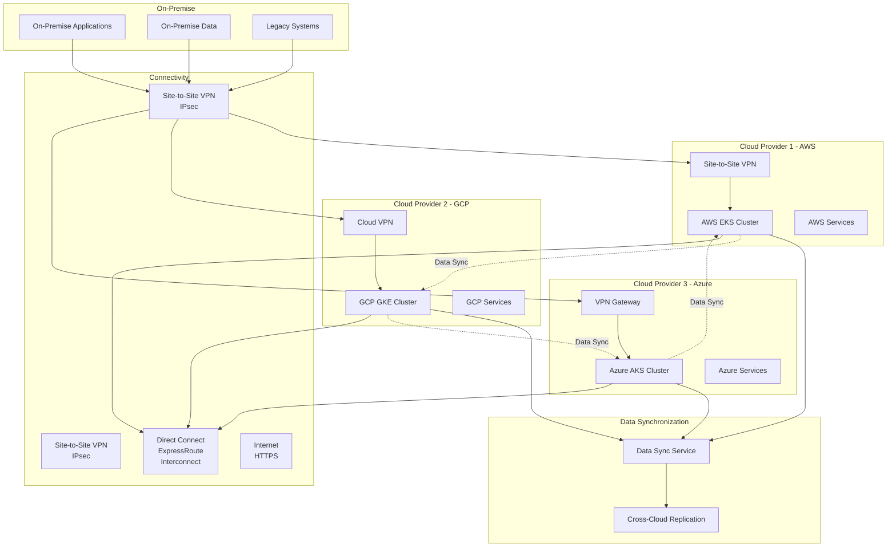

# Hybrid and Multicloud

## Hybrid and Multicloud Overview

This document describes deployment patterns and strategies for hybrid and multi-cloud architectures with the Officeless platform.

## Hybrid and Multi-Cloud Architecture

View Mermaid source code

View Mermaid source code

## Architecture Patterns

### Hybrid Cloud
- Cloud and on-premises integration
- Data sovereignty compliance
- Legacy system integration
- Network connectivity

### Multi-Cloud
- Multiple cloud provider deployment
- Vendor lock-in avoidance
- Best-of-breed services
- Disaster recovery

### Cloud Bursting
- On-demand cloud capacity
- Workload migration
- Cost optimization
- Scalability

## Deployment Scenarios

### Scenario 1: Cloud-First with On-Premises Integration
**Use Case:** Modern cloud-native applications with legacy system integration

**Architecture:**
- Primary deployment in cloud
- On-premises data sources
- Hybrid networking
- Data synchronization

### Scenario 2: Multi-Cloud Active-Active
**Use Case:** High availability and geographic distribution

**Architecture:**
- Services deployed across multiple clouds
- Load balancing across clouds
- Data replication
- Failover capabilities

### Scenario 3: Cloud Bursting
**Use Case:** Variable workloads with cost optimization

**Architecture:**
- Primary on-premises deployment
- Cloud capacity for peak loads
- Automatic scaling
- Workload migration

## Network Architecture

### Connectivity Options

#### VPN Connections
- Site-to-site VPN
- Point-to-site VPN
- Cloud VPN services
- Encryption and security

#### Direct Connect / ExpressRoute
- Private connectivity
- Higher bandwidth
- Lower latency
- Dedicated circuits

#### Software-Defined WAN (SD-WAN)
- Dynamic routing
- Multiple connectivity options
- Quality of service (QoS)
- Centralized management

### Network Segmentation
- Cloud VPC/VNet isolation
- On-premises network zones
- DMZ configuration
- Security boundaries

## Data Management

### Data Synchronization
- Real-time replication
- Batch synchronization
- Conflict resolution
- Data consistency

### Data Residency
- Geographic restrictions
- Compliance requirements
- Data localization
- Cross-border data transfer

### Data Replication Strategies
- Master-slave replication
- Multi-master replication
- Eventual consistency
- Strong consistency

## Identity and Access Management

### Federated Identity
- Single sign-on (SSO)
- Identity federation
- Directory synchronization
- Cross-cloud authentication

### Access Management
- Unified access policies
- Cross-cloud authorization
- Role synchronization
- Audit logging

## Service Mesh and Networking

### Service Mesh
- Cross-cloud service communication
- Traffic management
- Security policies
- Observability

### API Gateway
- Unified API endpoint
- Request routing
- Load balancing
- Authentication

## Disaster Recovery

### Backup Strategies
- Cross-cloud backups
- Geographic distribution
- Backup replication
- Recovery procedures

### Failover Mechanisms
- Automatic failover
- Manual failover
- Failover testing
- Recovery time objectives (RTO)

### Business Continuity
- RTO and RPO targets
- Disaster recovery plans
- Testing procedures
- Documentation

## Cost Management

### Cost Optimization
- Resource right-sizing
- Reserved instances
- Spot instances
- Cost allocation

### Cost Monitoring
- Multi-cloud cost tracking
- Cost comparison
- Budget alerts
- Cost reporting

## Security Considerations

### Security Policies
- Unified security policies
- Cross-cloud compliance
- Security monitoring
- Incident response

### Data Security
- Encryption in transit
- Encryption at rest
- Key management
- Access controls

### Network Security
- Firewall rules
- Network segmentation
- DDoS protection
- Intrusion detection

## Operational Challenges

### Complexity Management
- Unified monitoring
- Centralized logging
- Consistent tooling
- Operational procedures

### Skills and Training
- Multi-cloud expertise
- Tool familiarity
- Best practices
- Documentation

### Vendor Management
- Multiple vendor relationships
- SLA management
- Support processes
- Contract management

## Best Practices

### Architecture Design
- Cloud-agnostic design
- Abstraction layers
- Standard interfaces
- Portability

### Deployment
- Infrastructure as Code
- Consistent deployment processes
- Automated testing
- Version control

### Monitoring
- Unified observability
- Cross-cloud visibility
- Alerting
- Dashboards

## Use Cases

### Financial Services
- Regulatory compliance
- Data residency
- High availability
- Security requirements

### Government
- Data sovereignty
- Security classifications
- Hybrid deployment
- Compliance

### Enterprise
- Legacy integration
- Cloud migration
- Cost optimization
- Vendor diversification

## Related Documentation

- [Deployment Architecture](./03-deployment-architecture.md)
- [Security and Governance](./05-security-and-governance.md)
- [Observability](./06-observability.md)
