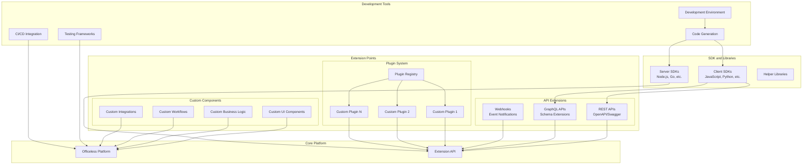

# Extensibility

## Extensibility Overview

This document describes the extensibility mechanisms, APIs, and customization options available in the Officeless platform.

## Extensibility Architecture

View Mermaid source code

View Mermaid source code

## Extension Points

### Plugin Architecture
- Plugin registration
- Plugin lifecycle
- Plugin dependencies
- Plugin isolation

### API Extensions
- REST API extensions
- GraphQL schema extensions
- Webhook integrations
- Event handlers

### Custom Components
- Custom UI components
- Custom business logic
- Custom workflows
- Custom integrations

## Extension Mechanisms

### Application Programming Interfaces (APIs)

#### REST APIs
- RESTful endpoints
- OpenAPI/Swagger specifications
- Authentication and authorization
- Rate limiting

#### GraphQL APIs
- Flexible querying
- Schema definition
- Resolver functions
- Subscriptions

#### Webhooks
- Event-driven notifications
- Payload customization
- Retry mechanisms
- Security

### SDKs and Libraries

#### Client SDKs
- Language-specific SDKs
- Type-safe interfaces
- Documentation
- Examples

#### Server SDKs
- Server-side libraries
- Framework integrations
- Helper functions
- Utilities

## Customization Options

### UI Customization
- Theme customization
- Layout modifications
- Component replacement
- Branding

### Business Logic Extension
- Custom functions
- Script execution
- Rule engines
- Workflow automation

### Data Model Extension
- Custom fields
- Custom entities
- Relationship extensions
- Validation rules

## Integration Patterns

### System Integration
- Enterprise system connectors
- Legacy system integration
- Third-party service integration
- Data synchronization

### Event-Driven Integration
- Event publishing
- Event subscription
- Event transformation
- Event routing

### API Integration
- External API consumption
- API composition
- API aggregation
- API transformation

## Development Tools

### Development Environment
- Local development setup
- Testing frameworks
- Debugging tools
- Development documentation

### CI/CD Integration
- Build automation
- Testing automation
- Deployment automation
- Version management

### Code Generation
- Scaffolding tools
- Code templates
- API client generation
- Documentation generation

## Extension Lifecycle

### Development
- Extension development
- Local testing
- Code review
- Documentation

### Deployment
- Extension packaging
- Version management
- Deployment process
- Rollback procedures

### Maintenance
- Updates and patches
- Compatibility management
- Deprecation policies
- Migration guides

## Security and Governance

### Extension Security
- Code review processes
- Security scanning
- Access controls
- Sandboxing

### Governance
- Extension registry
- Approval processes
- Version control
- Compliance

## Performance Considerations

### Optimization
- Caching strategies
- Lazy loading
- Resource management
- Performance monitoring

### Scalability
- Horizontal scaling
- Load distribution
- Resource allocation
- Capacity planning

## Best Practices

### Design Principles
- Modularity
- Loose coupling
- High cohesion
- Interface design

### Development Practices
- Code quality
- Testing coverage
- Documentation
- Version management

### Deployment Practices
- Gradual rollout
- Feature flags
- Monitoring
- Rollback plans

## Use Cases

### Industry-Specific Extensions
- Vertical market solutions
- Regulatory compliance
- Industry standards
- Custom workflows

### Enterprise Customization
- Branding and theming
- Custom integrations
- Business process automation
- Legacy system connectivity

### Third-Party Integrations
- Payment gateways
- Communication services
- Analytics platforms
- Marketing tools

## Examples

### Custom Workflow Extension
- Workflow definition
- Step implementation
- Integration points
- Error handling

### Custom Connector
- Connector development
- Authentication
- Data mapping
- Error handling

### Custom UI Component
- Component development
- Styling
- Integration
- Documentation

## Related Documentation

- [Platform Architecture](./02-platform-architecture.md)
- [Enterprise Integration](./09-enterprise-integration.md)
- [Security and Governance](./05-security-and-governance.md)
