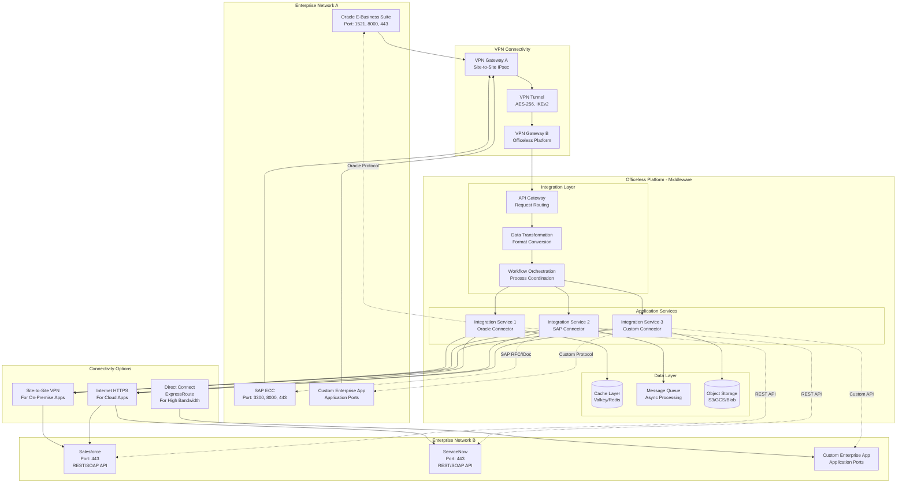

# Enterprise Integration

## Enterprise Integration Overview

This document describes integration patterns, enterprise systems connectivity, and migration strategies for the Officeless platform.

## Enterprise Integration Architecture

<div class="mermaid-diagram-container">



<details>
<summary>View Mermaid source code</summary>

<div class="mermaid-diagram-container">


<details>
<summary>View Mermaid source code</summary>



</details>

</div>

</details>

</div>

## Integration Architecture

### Integration Patterns

#### Point-to-Point Integration
- Direct system connections
- Simple use cases
- Limited scalability
- Maintenance overhead

#### Hub-and-Spoke Integration
- Central integration hub
- Multiple system connections
- Message routing
- Transformation services

#### Enterprise Service Bus (ESB)
- Service orchestration
- Message transformation
- Protocol mediation
- Service governance

#### API Gateway Pattern
- Unified API endpoint
- Request routing
- Protocol translation
- Security enforcement

## Enterprise Systems Integration

### Officeless as Middleware

Officeless platform serves as a middleware solution, enabling integration between enterprise applications through secure VPN connectivity. This architecture allows Officeless to:

- **Bridge Systems**: Connect disparate enterprise systems that cannot directly communicate
- **Data Transformation**: Transform data formats between different systems
- **Protocol Translation**: Convert between different communication protocols
- **Orchestration**: Coordinate workflows across multiple enterprise systems
- **Security**: Provide centralized security and access control

### Integration Architecture Pattern

```
┌─────────────────────┐         ┌──────────────────────┐         ┌─────────────────────┐
│  Enterprise App A   │         │   Officeless         │         │  Enterprise App B   │
│  (Source System)     │◄───────►│   Platform           │◄───────►│  (Target System)    │
│                     │  VPN    │   (Middleware)      │  VPN    │                     │
└─────────────────────┘         └──────────────────────┘         └─────────────────────┘
```

### ERP Systems

#### Oracle E-Business Suite (EBS)

**Integration Overview**
- **Deployment**: Typically on-premise
- **Connectivity**: Site-to-site VPN required
- **Protocols**: Database (TNS), HTTP/HTTPS, SOAP
- **Use Cases**: Order management, inventory, financial data integration

**Network Requirements**
- **Database Port**: 1521 (Oracle Database)
- **Application Ports**: 8000 (HTTP), 443 (HTTPS)
- **VPN Type**: Site-to-site IPsec VPN
- **Bandwidth**: 100 Mbps+ (based on data volume)

**Integration Methods**
- **Direct Database**: TNS connections to Oracle database
- **REST API**: HTTP/HTTPS API calls to Oracle EBS
- **SOAP Web Services**: SOAP-based integration
- **File Transfer**: SFTP/SCP for file-based integration
- **Oracle Integration Cloud (OIC)**: Cloud-based integration platform

**Authentication**
- **Database**: Username/password, Oracle Wallet
- **API**: OAuth 2.0, Basic Authentication
- **VPN**: Certificate-based or pre-shared key

**Data Formats**
- **Database**: SQL queries, PL/SQL procedures
- **API**: JSON, XML
- **Files**: CSV, XML, fixed-width formats

**See Also**: [Site-to-Site VPN Requirements](./12-site-to-site-vpn-requirements.md)

#### SAP Systems

**Integration Overview**
- **Deployment**: Typically on-premise (SAP ECC) or cloud (SAP S/4HANA Cloud)
- **Connectivity**: Site-to-site VPN for on-premise, Internet/API for cloud
- **Protocols**: RFC, HTTP/HTTPS, SOAP, OData
- **Use Cases**: ERP integration, master data synchronization, business process automation

**Network Requirements**
- **RFC Port**: 3300 (SAP RFC)
- **HTTP Port**: 8000 (SAP HTTP), 443 (HTTPS)
- **GUI Port**: 3200-3299 (SAP GUI)
- **VPN Type**: Site-to-site IPsec VPN (for on-premise)
- **Bandwidth**: 100 Mbps+ (based on data volume)

**Integration Methods**
- **RFC (Remote Function Call)**: Direct SAP function calls
- **REST API**: HTTP/HTTPS REST API (SAP S/4HANA)
- **OData**: Open Data Protocol for SAP systems
- **IDoc (Intermediate Document)**: SAP's document format for EDI
- **BAPI (Business Application Programming Interface)**: SAP business object interfaces
- **File Transfer**: SFTP for file-based integration

**Authentication**
- **RFC**: SAP user credentials
- **API**: OAuth 2.0, Basic Authentication, SAML
- **VPN**: Certificate-based or pre-shared key

**Data Formats**
- **RFC**: ABAP data types
- **IDoc**: XML or EDI format
- **API**: JSON, XML
- **Files**: CSV, XML, IDoc format

**SAP Products Supported**
- SAP ECC (ERP Central Component)
- SAP S/4HANA (on-premise and cloud)
- SAP Business Suite
- SAP SuccessFactors (HR)
- SAP Ariba (procurement)

**See Also**: [Site-to-Site VPN Requirements](./12-site-to-site-vpn-requirements.md)

### CRM Systems

#### Salesforce

**Integration Overview**
- **Deployment**: Cloud-based (SaaS)
- **Connectivity**: Internet (HTTPS) or Salesforce Private Connect
- **Protocols**: REST API, SOAP API, Streaming API, Bulk API
- **Use Cases**: Customer data synchronization, lead management, opportunity tracking

**Network Requirements**
- **API Port**: 443 (HTTPS)
- **VPN Type**: Not required (public API) or Salesforce Private Connect
- **Bandwidth**: Based on API call volume

**Integration Methods**
- **REST API**: Standard Salesforce REST API (v57.0+)
- **SOAP API**: Legacy SOAP API for enterprise integration
- **Streaming API**: Real-time event streaming (CometD)
- **Bulk API**: Large data operations (CSV, JSON, XML)
- **GraphQL API**: GraphQL-based queries (Pilot)
- **Platform Events**: Event-driven integration

**Authentication**
- **OAuth 2.0**: Authorization code flow, client credentials flow
- **JWT Bearer Token**: Server-to-server authentication
- **Username/Password**: Legacy authentication (not recommended)

**Data Formats**
- **REST/SOAP**: JSON, XML
- **Bulk API**: CSV, JSON, XML
- **Platform Events**: JSON

**Salesforce Products Supported**
- Salesforce Sales Cloud
- Salesforce Service Cloud
- Salesforce Marketing Cloud
- Salesforce Commerce Cloud
- Salesforce Platform (Custom Apps)

**Integration Patterns**
- **Real-time Sync**: Streaming API for real-time updates
- **Batch Sync**: Bulk API for large data transfers
- **Event-driven**: Platform Events for asynchronous processing
- **Webhook**: Outbound messaging (legacy)

**See Also**: [Site-to-Site VPN Requirements](./12-site-to-site-vpn-requirements.md)

#### Microsoft Dynamics 365

**Integration Overview**
- **Deployment**: Cloud-based (Azure)
- **Connectivity**: Internet (HTTPS) or Azure ExpressRoute
- **Protocols**: OData, REST API
- **Use Cases**: CRM integration, customer data management, sales automation

**Network Requirements**
- **API Port**: 443 (HTTPS)
- **VPN Type**: Not required (public API) or Azure ExpressRoute
- **Bandwidth**: Based on API call volume

**Integration Methods**
- **OData API**: Open Data Protocol (primary integration method)
- **REST API**: Standard REST API calls
- **Webhooks**: Event notifications
- **File Transfer**: Azure Blob Storage integration

**Authentication**
- **OAuth 2.0**: Azure AD authentication
- **Azure AD**: Service principal authentication
- **API Keys**: Legacy authentication

**Data Formats**
- **OData**: JSON, XML
- **REST**: JSON
- **Files**: Various formats via Blob Storage

**See Also**: [Multi-Cloud Deployment](./10-multi-cloud-deployment.md)

### Other Enterprise Applications

#### ServiceNow

**Integration Overview**
- **Deployment**: Cloud-based (SaaS)
- **Connectivity**: Internet (HTTPS) or ServiceNow Private Service Connect
- **Protocols**: REST API, SOAP API
- **Use Cases**: IT service management, workflow automation, incident management

**Network Requirements**
- **API Port**: 443 (HTTPS)
- **VPN Type**: Not required (public API) or Private Service Connect
- **Bandwidth**: Based on API call volume

**Integration Methods**
- **REST API**: Standard ServiceNow REST API
- **SOAP API**: Legacy SOAP API
- **Table API**: Direct database table access
- **Import Sets**: Bulk data import
- **File Transfer**: Attachment API

**Authentication**
- **OAuth 2.0**: OAuth authentication
- **Basic Authentication**: Username/password
- **API Keys**: ServiceNow API keys

#### Workday

**Integration Overview**
- **Deployment**: Cloud-based (SaaS)
- **Connectivity**: Internet (HTTPS) or Workday Private Connect
- **Protocols**: REST API, SOAP API
- **Use Cases**: HR data integration, payroll, benefits management

**Network Requirements**
- **API Port**: 443 (HTTPS)
- **VPN Type**: Not required (public API) or Workday Private Connect
- **Bandwidth**: Based on API call volume

**Integration Methods**
- **REST API**: Workday REST API
- **SOAP API**: Workday Web Services
- **Document API**: File-based integration
- **Report API**: Report-based data extraction

**Authentication**
- **OAuth 2.0**: OAuth authentication
- **Basic Authentication**: Username/password
- **Certificate**: Client certificate authentication

#### Custom Enterprise Applications

**Integration Overview**
- **Deployment**: On-premise or cloud
- **Connectivity**: VPN (on-premise) or Internet (cloud)
- **Protocols**: Application-specific (REST, SOAP, gRPC, etc.)
- **Use Cases**: Custom business application integration

**Network Requirements**
- **Application-Specific Ports**: As required by application
- **Protocol**: TCP, UDP (as required)
- **VPN Type**: Site-to-site IPsec VPN (for on-premise)
- **Bandwidth**: Based on application requirements

**Integration Methods**
- **REST API**: HTTP/HTTPS REST API
- **SOAP API**: SOAP/XML web services
- **gRPC**: High-performance RPC framework
- **Database**: Direct database connections
- **File Transfer**: SFTP, SCP, NFS, SMB
- **Message Queue**: AMQP, MQTT, Kafka

**Authentication**
- **Application-Specific**: OAuth, JWT, API keys, certificates
- **Database**: Database credentials
- **VPN**: Certificate-based or pre-shared key

**See Also**: [Site-to-Site VPN Requirements](./12-site-to-site-vpn-requirements.md)

### Identity Systems
- Active Directory integration
- LDAP integration
- Azure AD integration
- Okta integration

### Database Systems
- Database connectors
- ETL processes
- Data synchronization
- Query federation

### Legacy Systems
- Mainframe integration
- AS/400 integration
- Legacy API integration
- Screen scraping (when necessary)

## Integration Technologies

### REST APIs
- HTTP-based integration
- JSON/XML payloads
- Stateless communication
- Standard protocols

### SOAP Web Services
- XML-based integration
- WSDL definitions
- WS-* standards
- Enterprise-grade

### Message Queues
- Asynchronous messaging
- Message brokers
- Queue management
- Guaranteed delivery

### Event Streaming
- Real-time event processing
- Event sourcing
- Stream processing
- Event replay

### File-Based Integration
- File transfer protocols (FTP, SFTP)
- File formats (CSV, XML, JSON)
- Batch processing
- Scheduled transfers

## Data Integration

### ETL Processes
- Extract, Transform, Load
- Data mapping
- Data validation
- Error handling

### Data Synchronization
- Real-time sync
- Batch synchronization
- Conflict resolution
- Data consistency

### Data Transformation
- Format conversion
- Schema mapping
- Data enrichment
- Data cleansing

## Security and Authentication

### Authentication Methods
- API keys
- OAuth 2.0
- Basic authentication
- Certificate-based authentication
- SAML

### Authorization
- Role-based access
- API permissions
- Data access controls
- Audit logging

### Encryption
- TLS/SSL for data in transit
- Encryption at rest
- Key management
- Certificate management

## Integration Monitoring

### Health Monitoring
- Connection health
- Service availability
- Response times
- Error rates

### Message Tracking
- Message flow tracking
- Delivery confirmation
- Error tracking
- Audit trails

### Performance Monitoring
- Throughput metrics
- Latency measurement
- Resource utilization
- Bottleneck identification

## Migration Strategies

### Big Bang Migration
- Complete cutover
- High risk
- Requires extensive testing
- Minimal parallel run

### Phased Migration
- Incremental migration
- Lower risk
- Gradual transition
- Parallel run periods

### Parallel Run
- Dual system operation
- Data synchronization
- Validation
- Gradual cutover

### Blue-Green Migration
- Two identical environments
- Zero-downtime migration
- Instant rollback
- Testing in production-like environment

## Migration Planning

### Assessment
- System inventory
- Integration dependencies
- Data volume analysis
- Performance requirements

### Design
- Integration architecture
- Data mapping
- Transformation rules
- Error handling

### Implementation
- Development
- Testing
- Deployment
- Validation

### Cutover
- Migration execution
- Data migration
- System cutover
- Verification

## Best Practices

### Design Principles
- Loose coupling
- Standard protocols
- Idempotency
- Error handling

### Development Practices
- API versioning
- Documentation
- Testing
- Code review

### Operational Practices
- Monitoring
- Alerting
- Incident response
- Performance optimization

## Common Integration Scenarios

### Customer Data Integration
- Customer master data
- Profile synchronization
- Data enrichment
- Single customer view

### Order Processing
- Order creation
- Order status updates
- Inventory synchronization
- Fulfillment integration

### Financial Integration
- Payment processing
- Invoice generation
- Accounting integration
- Financial reporting

### HR Integration
- Employee data
- Organizational structure
- Payroll integration
- Benefits management

## Challenges and Solutions

### Data Quality
- Data validation
- Data cleansing
- Master data management
- Data governance

### Performance
- Caching strategies
- Batch processing
- Asynchronous processing
- Performance tuning

### Reliability
- Retry mechanisms
- Circuit breakers
- Fallback strategies
- Disaster recovery

## VPN Connectivity for Enterprise Integration

### Site-to-Site VPN Requirements

For on-premise enterprise applications (Oracle, SAP, custom applications), site-to-site VPN is required to establish secure connectivity between the enterprise network and Officeless platform.

**Key Requirements:**
- **VPN Type**: IPsec site-to-site VPN
- **Encryption**: AES-256 minimum
- **Authentication**: Certificate-based or pre-shared key
- **Routing**: Static routes or BGP
- **High Availability**: Redundant VPN tunnels

**See Also**: 
- [Site-to-Site VPN Requirements](./12-site-to-site-vpn-requirements.md) - Detailed VPN requirements
- [VPN and Connectivity](./11-vpn-connectivity.md) - VPN configuration guide

### Public API Integration

For cloud-based enterprise applications (Salesforce, ServiceNow, Workday), integration typically uses public APIs over HTTPS. VPN is optional but may be required for:
- **Private Connectivity**: Salesforce Private Connect, ServiceNow Private Service Connect
- **Compliance**: Regulatory requirements for private connectivity
- **Security**: Additional security layer for sensitive data

## Integration Patterns by Use Case

### Data Synchronization
- **Real-time**: Streaming APIs, webhooks, event-driven
- **Batch**: Scheduled ETL jobs, bulk APIs
- **Hybrid**: Real-time for critical data, batch for large volumes

### Process Orchestration
- **Workflow Automation**: Coordinate processes across systems
- **Event-Driven**: React to events from enterprise systems
- **Scheduled**: Time-based process execution

### Data Transformation
- **Format Conversion**: JSON, XML, CSV, EDI
- **Schema Mapping**: Field mapping between systems
- **Data Enrichment**: Add context from multiple sources

## Related Documentation

- [Platform Architecture](./02-platform-architecture.md) - Platform components
- [Extensibility](./08-extensibility.md) - Extension mechanisms
- [Security and Governance](./05-security-and-governance.md) - Security controls
- [Multi-Cloud Deployment](./10-multi-cloud-deployment.md) - Cloud deployment options
- [VPN and Connectivity](./11-vpn-connectivity.md) - VPN configuration
- [Site-to-Site VPN Requirements](./12-site-to-site-vpn-requirements.md) - Detailed VPN requirements
