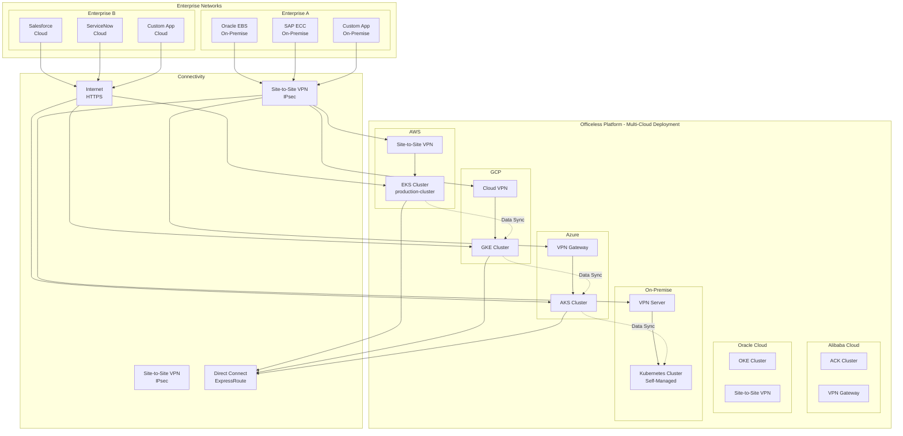

# Multi-Cloud Deployment Guide

## Overview

This document provides comprehensive deployment guidance for the Officeless platform across multiple cloud providers and on-premise environments. The platform is designed to be cloud-agnostic, enabling deployment flexibility based on organizational requirements, compliance needs, and geographic constraints.

## Multi-Cloud Deployment Architecture

<div class="mermaid-diagram-container">


<details>
<summary>View Mermaid source code</summary>



</details>

</div>

</details>

</div>

## Supported Platforms

### Public Cloud Providers
- **AWS (Amazon Web Services)** - Primary reference implementation
- **Google Cloud Platform (GCP)**
- **Microsoft Azure**
- **Alibaba Cloud**
- **Oracle Cloud Infrastructure (OCI)**
- **ByteDance Cloud (Volcano Engine)**
- **Huawei Cloud**

### On-Premise Deployment
- **Kubernetes Clusters** (self-managed or managed distributions)
- **VMware vSphere**
- **OpenStack**
- **Bare Metal**

## Deployment Patterns

### Pattern 1: Single Cloud Deployment
Deploy Officeless on a single cloud provider for simplicity and cost optimization.

### Pattern 2: Multi-Cloud Active-Active
Deploy Officeless across multiple cloud providers for high availability and disaster recovery.

### Pattern 3: Hybrid Cloud
Deploy Officeless in cloud with on-premise integration for legacy systems and data sovereignty.

### Pattern 4: Cloud-to-Cloud Migration
Deploy Officeless on one cloud with migration path to another cloud provider.

## Cloud Provider Comparison

| Feature | AWS | GCP | Azure | Alibaba | OCI | ByteDance | Huawei |
|---------|-----|-----|-------|---------|-----|-----------|--------|
| Managed Kubernetes | EKS | GKE | AKS | ACK | OKE | VKE | CCE |
| Container Registry | ECR | GCR | ACR | ACR | OCR | TCR | SWR |
| Object Storage | S3 | GCS | Blob | OSS | Object Storage | TOS | OBS |
| Block Storage | EBS | Persistent Disk | Managed Disks | EBS | Block Volume | EBS | EVS |
| File Storage | EFS | Filestore | Files | NAS | File Storage | NAS | SFS |
| Load Balancer | ALB/NLB | GLB | ALB | SLB | LB | CLB | ELB |
| VPN | Site-to-Site VPN | Cloud VPN | VPN Gateway | VPN Gateway | Site-to-Site VPN | VPN Gateway | VPN |
| Direct Connect | Direct Connect | Interconnect | ExpressRoute | Express Connect | FastConnect | Direct Connect | Direct Connect |

## AWS Deployment

### Reference Implementation
See [Deployment Architecture](./03-deployment-architecture.md) for detailed AWS deployment.

### Key Components
- **EKS Cluster**: Kubernetes 1.33
- **VPC**: Custom VPC with public/private subnets
- **Storage**: EBS (gp3), EFS, S3
- **Networking**: ALB, NAT Gateway, Internet Gateway
- **Security**: IAM, Pod Identity, Security Groups

### Access Patterns
- **Public Access**: Internet Gateway → ALB → EKS (public subnets)
- **Private Access**: VPN → Private Subnets → EKS (private endpoint)
- **Site-to-Site VPN**: AWS Site-to-Site VPN for enterprise connectivity

## Google Cloud Platform (GCP) Deployment

### GKE Cluster Configuration
- **Cluster Type**: Standard or Autopilot
- **Kubernetes Version**: 1.33+
- **Node Pools**: 
  - Instance types: n1-standard-4, n2-standard-4, e2-standard-4
  - Machine type: e2-standard-4 (recommended)
  - Disk: 200GB SSD persistent disk
- **Network**: VPC-native cluster
- **Private Cluster**: Recommended for production

### Storage Services
- **Block Storage**: Persistent Disk (pd-standard, pd-ssd)
- **File Storage**: Filestore (Basic or Enterprise)
- **Object Storage**: Cloud Storage (Standard, Nearline, Coldline)

### Networking
- **VPC**: Custom VPC with subnets
- **Load Balancing**: 
  - HTTP(S) Load Balancer (Ingress)
  - Network Load Balancer (Service)
- **VPN**: Cloud VPN (Site-to-Site or HA VPN)
- **Private Google Access**: For private GKE nodes

### Security
- **Workload Identity**: GCP equivalent of IRSA
- **IAM**: Service accounts with fine-grained permissions
- **Private Endpoint**: Private GKE cluster endpoint
- **Binary Authorization**: Container image verification

### Access Patterns
- **Public Access**: Internet → HTTP(S) Load Balancer → GKE Ingress
- **Private Access**: Cloud VPN → VPC → GKE (private endpoint)
- **Site-to-Site VPN**: Cloud VPN for enterprise connectivity

## Microsoft Azure Deployment

### AKS Cluster Configuration
- **Cluster Type**: Standard or Premium
- **Kubernetes Version**: 1.33+
- **Node Pools**:
  - VM Size: Standard_D4s_v3, Standard_D8s_v3
  - OS Disk: 200GB Premium SSD
  - Node count: 3-6 nodes
- **Network**: Azure CNI or kubenet
- **Private Cluster**: Recommended for production

### Storage Services
- **Block Storage**: Managed Disks (Premium SSD, Standard SSD)
- **File Storage**: Azure Files (SMB or NFS)
- **Object Storage**: Blob Storage (Hot, Cool, Archive tiers)

### Networking
- **VNet**: Virtual Network with subnets
- **Load Balancing**: 
  - Application Gateway (Ingress)
  - Azure Load Balancer (Service)
- **VPN**: VPN Gateway (Site-to-Site or Point-to-Site)
- **Private Endpoint**: Private AKS API server

### Security
- **Pod Identity**: Azure AD Pod Identity (AAD Pod Identity)
- **Managed Identity**: System-assigned or user-assigned
- **Azure RBAC**: Role-based access control
- **Private Link**: Private endpoint for services

### Access Patterns
- **Public Access**: Internet → Application Gateway → AKS Ingress
- **Private Access**: VPN Gateway → VNet → AKS (private endpoint)
- **Site-to-Site VPN**: VPN Gateway for enterprise connectivity

## Alibaba Cloud Deployment

### ACK Cluster Configuration
- **Cluster Type**: Managed Kubernetes Service
- **Kubernetes Version**: 1.33+
- **Node Pools**:
  - Instance types: ecs.c6.xlarge, ecs.c6.2xlarge
  - System disk: 200GB cloud_essd
  - Node count: 3-6 nodes
- **Network**: Terway (recommended) or Flannel
- **Private Cluster**: Available

### Storage Services
- **Block Storage**: Cloud Disk (ESSD, SSD, Ultra Disk)
- **File Storage**: NAS (Network Attached Storage)
- **Object Storage**: OSS (Object Storage Service)

### Networking
- **VPC**: Virtual Private Cloud with vSwitches
- **Load Balancing**: 
  - Application Load Balancer (ALB)
  - Network Load Balancer (NLB)
- **VPN**: VPN Gateway (IPsec VPN)
- **Express Connect**: Dedicated connection

### Security
- **RAM Roles**: Resource Access Management roles
- **Service Accounts**: Kubernetes service accounts
- **Private Zone**: Private DNS
- **Security Groups**: Network access control

### Access Patterns
- **Public Access**: Internet → ALB → ACK Ingress
- **Private Access**: VPN Gateway → VPC → ACK (private endpoint)
- **Site-to-Site VPN**: VPN Gateway for enterprise connectivity

## Oracle Cloud Infrastructure (OCI) Deployment

### OKE Cluster Configuration
- **Cluster Type**: Managed Kubernetes Service
- **Kubernetes Version**: 1.33+
- **Node Pools**:
  - Shape: VM.Standard.E4.Flex (4 OCPUs, 64GB RAM)
  - Boot volume: 200GB Block Volume
  - Node count: 3-6 nodes
- **Network**: CNI (OCI VCN-native)
- **Private Cluster**: Available

### Storage Services
- **Block Storage**: Block Volumes (Balanced, Higher Performance)
- **File Storage**: File Storage Service (NFS)
- **Object Storage**: Object Storage (Standard, Archive)

### Networking
- **VCN**: Virtual Cloud Network with subnets
- **Load Balancing**: 
  - Load Balancer (Layer 7)
  - Network Load Balancer (Layer 4)
- **VPN**: Site-to-Site VPN (IPsec)
- **FastConnect**: Dedicated connection

### Security
- **IAM Policies**: Identity and Access Management
- **Service Accounts**: Kubernetes service accounts
- **Private Endpoint**: Private OKE API endpoint
- **Vault**: Key management service

### Access Patterns
- **Public Access**: Internet → Load Balancer → OKE Ingress
- **Private Access**: Site-to-Site VPN → VCN → OKE (private endpoint)
- **Site-to-Site VPN**: Site-to-Site VPN for enterprise connectivity

## ByteDance Cloud (Volcano Engine) Deployment

### VKE Cluster Configuration
- **Cluster Type**: Managed Kubernetes Service
- **Kubernetes Version**: 1.33+
- **Node Pools**:
  - Instance types: ecs.g1ie.xlarge, ecs.g1ie.2xlarge
  - System disk: 200GB ESSD
  - Node count: 3-6 nodes
- **Network**: VPC-CNI
- **Private Cluster**: Available

### Storage Services
- **Block Storage**: Cloud Block Storage (CBS)
- **File Storage**: Cloud File Storage (CFS)
- **Object Storage**: TOS (TikTok Object Storage)

### Networking
- **VPC**: Virtual Private Cloud with subnets
- **Load Balancing**: 
  - Application Load Balancer
  - Network Load Balancer
- **VPN**: VPN Gateway (IPsec)
- **Direct Connect**: Dedicated connection

### Security
- **IAM**: Identity and Access Management
- **Service Accounts**: Kubernetes service accounts
- **Private Endpoint**: Private VKE API endpoint
- **Security Groups**: Network access control

### Access Patterns
- **Public Access**: Internet → ALB → VKE Ingress
- **Private Access**: VPN Gateway → VPC → VKE (private endpoint)
- **Site-to-Site VPN**: VPN Gateway for enterprise connectivity

## Huawei Cloud Deployment

### CCE Cluster Configuration
- **Cluster Type**: Cloud Container Engine
- **Kubernetes Version**: 1.33+
- **Node Pools**:
  - Flavor: s6.xlarge.2, s6.2xlarge.2
  - System disk: 200GB SSD
  - Node count: 3-6 nodes
- **Network**: VPC network
- **Private Cluster**: Available

### Storage Services
- **Block Storage**: Elastic Volume Service (EVS)
- **File Storage**: Scalable File Service (SFS)
- **Object Storage**: Object Storage Service (OBS)

### Networking
- **VPC**: Virtual Private Cloud with subnets
- **Load Balancing**: 
  - Elastic Load Balance (ELB)
  - Application Load Balancer
- **VPN**: VPN Gateway (IPsec)
- **Direct Connect**: Dedicated connection

### Security
- **IAM**: Identity and Access Management
- **Service Accounts**: Kubernetes service accounts
- **Private Endpoint**: Private CCE API endpoint
- **Security Groups**: Network access control

### Access Patterns
- **Public Access**: Internet → ELB → CCE Ingress
- **Private Access**: VPN Gateway → VPC → CCE (private endpoint)
- **Site-to-Site VPN**: VPN Gateway for enterprise connectivity

## On-Premise Deployment

### Kubernetes Distribution Options
- **Kubernetes (Vanilla)**: Self-managed Kubernetes
- **Rancher**: Kubernetes management platform
- **OpenShift**: Enterprise Kubernetes (Red Hat)
- **VMware Tanzu**: Enterprise Kubernetes (VMware)
- **K3s**: Lightweight Kubernetes
- **K0s**: Zero-friction Kubernetes

### Infrastructure Requirements
- **Compute**: 
  - Minimum: 3 nodes (control plane + workers)
  - Recommended: 6+ nodes for HA
  - CPU: 4+ cores per node
  - Memory: 16GB+ per node
- **Storage**:
  - Block storage: Local or network-attached (NFS, iSCSI)
  - File storage: NFS server or distributed file system
  - Object storage: MinIO, Ceph, or compatible S3
- **Networking**:
  - Load balancer: MetalLB, F5, or hardware load balancer
  - Ingress: NGINX Ingress, Traefik, or HAProxy
  - VPN: OpenVPN, WireGuard, or hardware VPN

### Storage Solutions
- **Block Storage**: 
  - Local storage (hostPath)
  - Network storage (NFS, iSCSI, Ceph RBD)
  - Distributed storage (Longhorn, Rook/Ceph)
- **File Storage**:
  - NFS server
  - GlusterFS
  - CephFS
- **Object Storage**:
  - MinIO (S3-compatible)
  - Ceph Object Gateway
  - Swift

### Networking
- **Load Balancing**: 
  - MetalLB (BGP or Layer 2)
  - Hardware load balancer (F5, A10)
  - Keepalived + HAProxy
- **Ingress**: 
  - NGINX Ingress Controller
  - Traefik
  - HAProxy Ingress
- **VPN**: 
  - OpenVPN Access Server
  - WireGuard
  - StrongSwan (IPsec)

### Access Patterns
- **Intranet Access**: Internal network → Load Balancer → Kubernetes Ingress
- **VPN Access**: VPN → Internal network → Kubernetes
- **Site-to-Site VPN**: VPN tunnel to enterprise network

## Common Deployment Patterns

### Pattern 1: Public Internet Access
```
Internet → Cloud Load Balancer → Kubernetes Ingress → Application Pods
```
- Suitable for: Public-facing applications
- Security: WAF, DDoS protection, SSL/TLS termination

### Pattern 2: Private Network Access
```
Enterprise Network → VPN → Cloud VPC → Private Kubernetes Endpoint → Application Pods
```
- Suitable for: Internal applications, compliance requirements
- Security: VPN encryption, private endpoints, network policies

### Pattern 3: Hybrid Access
```
Public: Internet → Load Balancer → Ingress → Public Services
Private: VPN → Private Endpoint → Internal Services
```
- Suitable for: Mixed public/private workloads
- Security: Network segmentation, separate ingress controllers

## Migration Between Clouds

### Cloud-Agnostic Components
- **Kubernetes**: Standard Kubernetes API
- **Container Images**: Multi-arch images (amd64, arm64)
- **Helm Charts**: Cloud-agnostic Helm charts
- **Application Code**: Platform-independent code

### Cloud-Specific Components
- **Storage Classes**: Provider-specific storage classes
- **Load Balancers**: Cloud-specific load balancer annotations
- **IAM Integration**: Provider-specific IAM mechanisms
- **Networking**: Cloud-specific networking configurations

### Migration Strategy
1. **Assessment**: Identify cloud-specific dependencies
2. **Abstraction**: Use cloud-agnostic abstractions where possible
3. **Testing**: Test in target cloud environment
4. **Migration**: Gradual migration with blue-green deployment
5. **Validation**: Verify functionality and performance

## Related Documentation

- [Deployment Architecture](./03-deployment-architecture.md) - AWS reference implementation
- [Hybrid and Multicloud](./07-hybrid-and-multicloud.md) - Hybrid deployment patterns
- [VPN and Connectivity](./11-vpn-connectivity.md) - VPN configuration details
- [Enterprise Integration](./09-enterprise-integration.md) - Enterprise system integration
