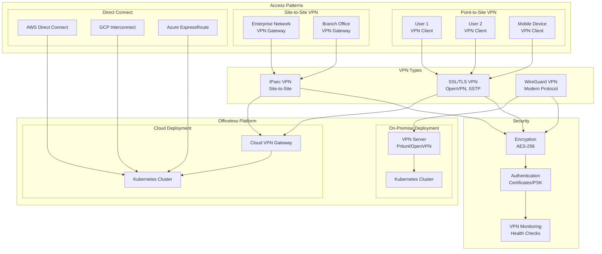

# VPN and Connectivity Guide

## Overview

This document describes VPN and connectivity options for the Officeless platform, enabling secure access from enterprise networks, remote locations, and bridging between cloud and on-premise environments.

## VPN Connectivity Architecture



## Connectivity Patterns

### Pattern 1: Point-to-Site VPN
Individual users or devices connect to Officeless platform via VPN client.

### Pattern 2: Site-to-Site VPN
Enterprise network connects to Officeless platform via VPN gateway.

### Pattern 3: Direct Connect / ExpressRoute
Dedicated private connection between enterprise and cloud provider.

### Pattern 4: Intranet Access
Direct access via internal enterprise network (on-premise deployment).

## VPN Types

### IPsec VPN
- **Protocol**: IPsec (Internet Protocol Security)
- **Use Cases**: Site-to-site VPN, high-performance requirements
- **Encryption**: AES-256, AES-128
- **Authentication**: Pre-shared keys, certificates
- **Cloud Support**: All major cloud providers

### SSL/TLS VPN
- **Protocol**: SSL/TLS (OpenVPN, SSTP)
- **Use Cases**: Point-to-site VPN, remote access
- **Encryption**: TLS 1.2+, AES-256
- **Authentication**: Username/password, certificates, MFA
- **Cloud Support**: All major cloud providers

### WireGuard VPN
- **Protocol**: WireGuard (modern VPN protocol)
- **Use Cases**: Point-to-site VPN, high-performance requirements
- **Encryption**: ChaCha20Poly1305, AES-256
- **Authentication**: Public key cryptography
- **Cloud Support**: Self-managed deployment

## Cloud Provider VPN Services

### AWS VPN

#### Site-to-Site VPN
- **Service**: AWS Site-to-Site VPN
- **Protocol**: IPsec
- **High Availability**: Two VPN tunnels per connection
- **Bandwidth**: Up to 1.25 Gbps per tunnel
- **Pricing**: Per hour + data transfer

#### Client VPN
- **Service**: AWS Client VPN
- **Protocol**: OpenVPN
- **Authentication**: Active Directory, SAML, certificate
- **Endpoint**: Managed VPN endpoint
- **Pricing**: Per hour + data transfer

#### VPN Gateway Requirements
- **Customer Gateway**: On-premise VPN device (IP address or BGP)
- **Virtual Private Gateway**: AWS-managed VPN gateway
- **Transit Gateway**: For multi-VPC connectivity

### Google Cloud VPN

#### Cloud VPN
- **Service**: Cloud VPN
- **Protocol**: IPsec
- **Types**: 
  - Classic VPN (static routing)
  - HA VPN (dynamic routing with BGP)
- **Bandwidth**: Up to 3 Gbps per tunnel
- **High Availability**: HA VPN with 99.99% SLA

#### Client VPN
- **Service**: Cloud VPN (Point-to-Site)
- **Protocol**: OpenVPN, IKEv2
- **Authentication**: OAuth, certificate
- **Implementation**: Third-party solutions (Pritunl, OpenVPN Access Server)

### Azure VPN

#### VPN Gateway
- **Service**: Azure VPN Gateway
- **Protocol**: IPsec, IKEv2
- **Types**:
  - Policy-based VPN (static routing)
  - Route-based VPN (dynamic routing)
- **SKUs**: Basic, VpnGw1-5, VpnGw1AZ-5AZ
- **Bandwidth**: 100 Mbps to 10 Gbps

#### Point-to-Site VPN
- **Service**: Point-to-Site VPN
- **Protocol**: SSTP, IKEv2, OpenVPN
- **Authentication**: Azure AD, certificate, RADIUS
- **Client**: Native Windows, macOS, Linux clients

### Alibaba Cloud VPN

#### VPN Gateway
- **Service**: VPN Gateway
- **Protocol**: IPsec
- **Types**: 
  - IPsec VPN (site-to-site)
  - SSL VPN (point-to-site)
- **Bandwidth**: 5 Mbps to 1 Gbps
- **High Availability**: Active-standby mode

### Oracle Cloud VPN

#### Site-to-Site VPN
- **Service**: Site-to-Site VPN
- **Protocol**: IPsec
- **Bandwidth**: Up to 10 Gbps
- **High Availability**: Multiple tunnels supported

### ByteDance Cloud VPN

#### VPN Gateway
- **Service**: VPN Gateway
- **Protocol**: IPsec
- **Bandwidth**: Configurable
- **High Availability**: Supported

### Huawei Cloud VPN

#### VPN Gateway
- **Service**: VPN Gateway
- **Protocol**: IPsec
- **Bandwidth**: Up to 1 Gbps
- **High Availability**: Active-standby

## On-Premise VPN Solutions

### OpenVPN
- **Type**: SSL/TLS VPN
- **Deployment**: Self-managed on EC2/VM
- **Features**: 
  - Cross-platform clients
  - Flexible authentication
  - High performance
- **Use Case**: Point-to-site VPN, remote access

### Pritunl
- **Type**: OpenVPN/WireGuard management
- **Deployment**: Self-managed on EC2/VM
- **Features**:
  - Web-based management
  - User management
  - Multi-server support
- **Use Case**: Enterprise VPN solution

### WireGuard
- **Type**: Modern VPN protocol
- **Deployment**: Self-managed
- **Features**:
  - High performance
  - Simple configuration
  - Modern cryptography
- **Use Case**: High-performance VPN

### StrongSwan
- **Type**: IPsec VPN
- **Deployment**: Self-managed
- **Features**:
  - IPsec/IKEv2 support
  - Certificate-based authentication
  - Site-to-site VPN
- **Use Case**: Site-to-site VPN

## Site-to-Site VPN Configuration

### AWS Site-to-Site VPN Setup

#### Prerequisites
- Customer Gateway (on-premise VPN device)
- Virtual Private Gateway or Transit Gateway
- Static IP address or BGP configuration

#### Configuration Steps
1. **Create Customer Gateway**
   - Public IP address of on-premise VPN device
   - BGP ASN (if using dynamic routing)
   - Device type (generic)

2. **Create Virtual Private Gateway**
   - Attach to VPC
   - Enable route propagation

3. **Create VPN Connection**
   - Customer Gateway
   - Virtual Private Gateway
   - Routing: Static or Dynamic (BGP)
   - Tunnel options: IPsec configuration

4. **Configure On-Premise VPN Device**
   - IPsec Phase 1 (IKE) parameters
   - IPsec Phase 2 (ESP) parameters
   - Pre-shared key or certificates
   - BGP configuration (if dynamic routing)

#### IPsec Configuration
- **Phase 1 (IKE)**:
  - Encryption: AES-256
  - Authentication: SHA-256
  - Diffie-Hellman: Group 14 (2048-bit)
  - Lifetime: 28800 seconds

- **Phase 2 (ESP)**:
  - Encryption: AES-256
  - Authentication: SHA-256
  - Perfect Forward Secrecy: Enabled
  - Lifetime: 3600 seconds

### GCP Cloud VPN Setup

#### HA VPN Configuration
1. **Create HA VPN Gateway**
   - Region selection
   - Network attachment

2. **Create VPN Tunnels**
   - Peer IP addresses
   - Shared secret
   - IKE version (IKEv2)
   - BGP configuration

3. **Create Router**
   - BGP configuration
   - Advertised routes
   - Peer ASN

### Azure VPN Gateway Setup

#### Route-Based VPN Configuration
1. **Create Virtual Network Gateway**
   - Gateway type: VPN
   - VPN type: Route-based
   - SKU selection
   - Public IP address

2. **Create Local Network Gateway**
   - On-premise gateway IP
   - Address space

3. **Create Connection**
   - Shared key
   - Connection type: IPsec

## VPN for Officeless Middleware Integration

### Architecture Pattern
```
Enterprise Application (Oracle/SAP/Salesforce)
    ↓
Site-to-Site VPN
    ↓
Officeless Platform (Cloud/On-Premise)
    ↓
Site-to-Site VPN
    ↓
Target Enterprise Application
```

### Requirements

#### Network Requirements
- **IP Address Ranges**: Non-overlapping CIDR blocks
- **Routing**: Static routes or BGP
- **MTU**: 1400 bytes (recommended for IPsec)
- **Bandwidth**: Based on data transfer requirements

#### Security Requirements
- **Encryption**: AES-256 minimum
- **Authentication**: Certificates or pre-shared keys
- **Key Exchange**: IKEv2 with Perfect Forward Secrecy
- **Monitoring**: VPN tunnel monitoring and alerting

#### High Availability
- **Redundant Tunnels**: Multiple VPN tunnels for failover
- **BGP**: Dynamic routing for automatic failover
- **Health Checks**: VPN tunnel health monitoring

### Integration Points

#### Oracle E-Business Suite
- **Protocol**: Database connections (TNS), HTTP/HTTPS
- **Ports**: 1521 (Oracle Database), 443 (HTTPS)
- **Network**: Site-to-site VPN to Oracle network
- **Authentication**: Database credentials, OAuth

#### SAP Systems
- **Protocol**: RFC, HTTP/HTTPS, SOAP
- **Ports**: 8000 (SAP GUI), 443 (HTTPS), 3300 (RFC)
- **Network**: Site-to-site VPN to SAP network
- **Authentication**: SAP credentials, SSO

#### Salesforce
- **Protocol**: REST API, SOAP API, Streaming API
- **Ports**: 443 (HTTPS)
- **Network**: Internet or VPN (if Salesforce private network)
- **Authentication**: OAuth 2.0, JWT

#### Other Enterprise Applications
- **Microsoft Dynamics**: REST API, OData (443)
- **ServiceNow**: REST API (443)
- **Workday**: REST API, SOAP (443)
- **Custom Applications**: Application-specific protocols

## VPN Monitoring and Troubleshooting

### Monitoring
- **Tunnel Status**: Active/Inactive
- **Bandwidth Utilization**: Throughput monitoring
- **Latency**: Round-trip time
- **Packet Loss**: Error rate monitoring
- **Connection Events**: Tunnel up/down events

### Troubleshooting
- **Tunnel Down**: Check IPsec configuration, routing, firewall rules
- **High Latency**: Check network path, bandwidth utilization
- **Packet Loss**: Check MTU settings, network congestion
- **Authentication Failures**: Verify certificates, pre-shared keys

## Best Practices

### Security
- Use strong encryption (AES-256)
- Enable Perfect Forward Secrecy
- Use certificate-based authentication
- Implement VPN tunnel monitoring
- Regular security audits

### Performance
- Optimize MTU settings
- Use BGP for dynamic routing
- Implement redundant tunnels
- Monitor bandwidth utilization
- Optimize routing tables

### High Availability
- Deploy redundant VPN tunnels
- Use BGP for automatic failover
- Implement health checks
- Test failover scenarios
- Document recovery procedures

## Related Documentation

- [Multi-Cloud Deployment](./10-multi-cloud-deployment.md) - Cloud-specific VPN services
- [Enterprise Integration](./09-enterprise-integration.md) - Enterprise application integration
- [Site-to-Site VPN Requirements](./12-site-to-site-vpn-requirements.md) - Detailed VPN requirements
