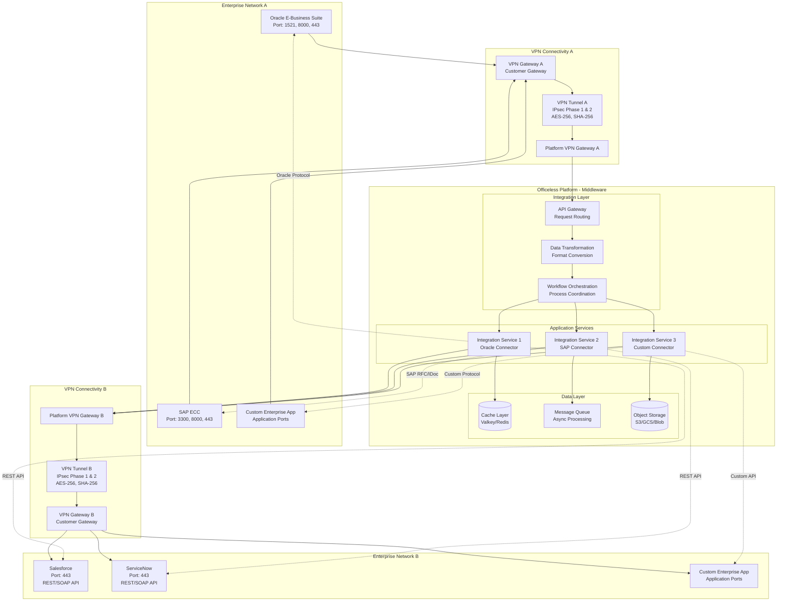

# Site-to-Site VPN Requirements for Enterprise Integration

## Overview

This document provides detailed requirements for establishing site-to-site VPN connections to enable Officeless platform as a middleware solution between enterprise applications. This enables secure, reliable connectivity between Officeless and enterprise systems such as Oracle, SAP, Salesforce, and other enterprise applications.

## Use Case: Officeless as Middleware

### Architecture Pattern

```mermaid
graph LR
    subgraph "Enterprise Network A"
        AppA[Enterprise App A<br/>Oracle/SAP/etc]
    end
    
    subgraph "VPN Tunnel 1"
        VPN1[Site-to-Site VPN<br/>IPsec AES-256]
    end
    
    subgraph<div class="mermaid-diagram-container">


<details>
<summary>View Mermaid source code</summary>

```mermaid
graph LR
    subgraph "Enterprise Network A"
        AppA[Enterprise App A<br/>Oracle/SAP/etc]
    end
    
    subgraph "VPN Tunnel 1"
        VPN1[Site-to-Site VPN<br/>IPsec AES-256]
    end
    
    subgraph "Officeless Platform"
        Middleware[Officeless<br/>Middleware Solution]
        Transform[Data Transformation]
        Orchestrate[Workflow Orchestration]
    end
    
    subgraph "VPN Tunnel 2"
        VPN2[Site-to-Site VPN<br/>IPsec AES-256]
    end
    
    subgraph "Enterprise Network B"
        AppB[Enterprise App B<br/>Salesforce/etc]
    end
    
    AppA --> VPN1
    VPN1 --> Middleware
    Middleware --> Transform
    Transform --> Orchestrate
    Orchestrate --> VPN2
    VPN2 --> AppB
    
    style AppA fill:#e1f5ff
    style AppB fill:#e1f5ff
    style Middleware fill:#fff4e1
    style VPN1 fill:#ffe1e1
    style VPN2 fill:#ffe1e1
```

</details>

</div>urce code</summary>

<div class="mermaid-diagram-container">


<details>
<summary>View Mermaid source code</summary>



</details>

</div>

</details>

</div>

### Integration Scenarios

#### Scenario 1: On-Premise to Cloud
- Enterprise application (on-premise) → VPN → Officeless (cloud) → Target system

#### Scenario 2: Cloud to Cloud
- Enterprise application (cloud) → VPN → Officeless (cloud) → Target system

#### Scenario 3: On-Premise to On-Premise
- Enterprise application (on-premise) → VPN → Officeless (on-premise) → Target system

#### Scenario 4: Multi-Enterprise
- Enterprise A → VPN → Officeless → VPN → Enterprise B

## Network Requirements

### IP Addressing

#### Officeless Platform Network
- **VPC CIDR**: 10.1.0.0/16 (example, configurable)
- **Subnet Ranges**: 
  - Public subnets: 10.1.0.0/20, 10.1.16.0/20, 10.1.80.0/20
  - Private subnets: 10.1.32.0/20, 10.1.48.0/20, 10.1.64.0/20
- **Kubernetes Pod CIDR**: 10.244.0.0/16 (example, configurable)
- **Kubernetes Service CIDR**: 10.96.0.0/12 (example, configurable)

#### Enterprise Network Requirements
- **Non-Overlapping CIDR**: Enterprise network must not overlap with Officeless network
- **Route Advertisement**: Enterprise must advertise routes to Officeless
- **Static Routes**: Configure static routes if BGP not available

### Routing Requirements

#### Static Routing
- **Route Table**: Add routes for enterprise network ranges
- **Next Hop**: VPN gateway or tunnel endpoint
- **Propagation**: Enable route propagation in VPC

#### Dynamic Routing (BGP)
- **BGP ASN**: 
  - Officeless: 64512-65534 (private ASN range)
  - Enterprise: Customer-provided ASN
- **BGP Peering**: Establish BGP sessions over VPN tunnels
- **Route Advertisement**: 
  - Officeless advertises: Platform network ranges
  - Enterprise advertises: Enterprise network ranges
- **Route Filters**: Implement route filters for security

### MTU and Fragmentation

#### Recommended MTU
- **IPsec VPN**: 1400 bytes (to account for IPsec overhead)
- **Standard MTU**: 1500 bytes (without VPN)
- **Jumbo Frames**: 9000 bytes (if supported end-to-end)

#### Path MTU Discovery
- Enable PMTUD on all systems
- Configure ICMP handling for PMTUD
- Monitor for fragmentation issues

### Bandwidth Requirements

#### Minimum Requirements
- **Small Deployment**: 10 Mbps per VPN tunnel
- **Medium Deployment**: 100 Mbps per VPN tunnel
- **Large Deployment**: 1 Gbps per VPN tunnel

#### High Availability
- **Redundant Tunnels**: 2+ VPN tunnels for failover
- **Load Balancing**: Distribute traffic across tunnels
- **Automatic Failover**: BGP-based failover

## Security Requirements

### Encryption

#### IPsec Phase 1 (IKE)
- **Encryption Algorithm**: AES-256 (required), AES-128 (optional)
- **Integrity Algorithm**: SHA-256 (required), SHA-1 (deprecated)
- **Diffie-Hellman Group**: Group 14 (2048-bit) minimum, Group 15 (3072-bit) recommended
- **IKE Version**: IKEv2 (required), IKEv1 (legacy only)
- **Lifetime**: 28800 seconds (8 hours)

#### IPsec Phase 2 (ESP)
- **Encryption Algorithm**: AES-256 (required), AES-128 (optional)
- **Integrity Algorithm**: SHA-256 (required), SHA-1 (deprecated)
- **Perfect Forward Secrecy**: Enabled (required)
- **PFS Group**: Group 14 (2048-bit) minimum
- **Lifetime**: 3600 seconds (1 hour)

### Authentication

#### Pre-Shared Key (PSK)
- **Key Length**: Minimum 32 characters
- **Complexity**: Random, alphanumeric + special characters
- **Rotation**: Every 90 days (recommended)
- **Storage**: Secure key management system

#### Certificate-Based Authentication
- **Certificate Authority**: Enterprise CA or public CA
- **Certificate Format**: X.509
- **Key Size**: RSA 2048-bit minimum, RSA 4096-bit recommended
- **Validity Period**: 1-2 years
- **Revocation**: CRL or OCSP

### Access Control

#### Network Access Control Lists (NACLs)
- **Ingress Rules**: Allow only required ports from enterprise networks
- **Egress Rules**: Restrict outbound traffic
- **Logging**: Enable flow logs for monitoring

#### Security Groups
- **Application Security Groups**: Restrict access to application ports
- **Database Security Groups**: Restrict database access
- **Least Privilege**: Allow only required traffic

#### Firewall Rules
- **Stateful Inspection**: Enable stateful firewall
- **Deep Packet Inspection**: Optional for advanced security
- **Intrusion Detection**: IDS/IPS integration

## Enterprise Application Integration

### Oracle E-Business Suite

#### Network Requirements
- **Database Port**: 1521 (Oracle Database)
- **Application Ports**: 8000 (HTTP), 443 (HTTPS)
- **Protocol**: TCP
- **Source IP**: Enterprise network ranges
- **Destination IP**: Officeless platform network

#### VPN Configuration
- **Tunnel Type**: Site-to-site IPsec VPN
- **Routing**: Static routes or BGP for Oracle network ranges
- **MTU**: 1400 bytes
- **Bandwidth**: Based on data volume (typically 100 Mbps+)

#### Integration Points
- **Database**: Direct database connections via TNS
- **REST API**: HTTP/HTTPS API calls
- **File Transfer**: SFTP, SCP for file-based integration

### SAP Systems

#### Network Requirements
- **RFC Port**: 3300 (SAP RFC)
- **HTTP Port**: 8000 (SAP HTTP), 443 (HTTPS)
- **GUI Port**: 3200-3299 (SAP GUI)
- **Protocol**: TCP
- **Source IP**: Enterprise network ranges
- **Destination IP**: Officeless platform network

#### VPN Configuration
- **Tunnel Type**: Site-to-site IPsec VPN
- **Routing**: Static routes or BGP for SAP network ranges
- **MTU**: 1400 bytes
- **Bandwidth**: Based on data volume (typically 100 Mbps+)

#### Integration Points
- **RFC**: Remote Function Call for SAP integration
- **REST API**: HTTP/HTTPS API calls
- **IDoc**: Intermediate Document processing
- **File Transfer**: SFTP for file-based integration

### Salesforce

#### Network Requirements
- **API Port**: 443 (HTTPS)
- **Protocol**: TCP
- **Source IP**: Officeless platform network
- **Destination IP**: Salesforce IP ranges (public)

#### VPN Configuration
- **Tunnel Type**: Not required (public API)
- **Alternative**: Salesforce Private Connect (if available)
- **Authentication**: OAuth 2.0, JWT

#### Integration Points
- **REST API**: Standard Salesforce REST API
- **SOAP API**: Legacy SOAP API
- **Streaming API**: Real-time event streaming
- **Bulk API**: Large data operations

### Microsoft Dynamics

#### Network Requirements
- **API Port**: 443 (HTTPS)
- **OData Port**: 443 (HTTPS)
- **Protocol**: TCP
- **Source IP**: Officeless platform network
- **Destination IP**: Dynamics 365 IP ranges

#### VPN Configuration
- **Tunnel Type**: Not required (public API)
- **Alternative**: Azure ExpressRoute (if Dynamics on Azure)
- **Authentication**: OAuth 2.0, Azure AD

#### Integration Points
- **OData API**: Open Data Protocol
- **REST API**: Standard REST API
- **File Transfer**: Azure Blob Storage integration

### ServiceNow

#### Network Requirements
- **API Port**: 443 (HTTPS)
- **Protocol**: TCP
- **Source IP**: Officeless platform network
- **Destination IP**: ServiceNow instance IP

#### VPN Configuration
- **Tunnel Type**: Not required (public API)
- **Alternative**: ServiceNow Private Service Connect (if available)
- **Authentication**: OAuth 2.0, Basic Auth

#### Integration Points
- **REST API**: Standard ServiceNow REST API
- **SOAP API**: Legacy SOAP API
- **File Transfer**: Attachment API

### Workday

#### Network Requirements
- **API Port**: 443 (HTTPS)
- **Protocol**: TCP
- **Source IP**: Officeless platform network
- **Destination IP**: Workday instance IP

#### VPN Configuration
- **Tunnel Type**: Not required (public API)
- **Alternative**: Workday Private Connect (if available)
- **Authentication**: OAuth 2.0, Basic Auth

#### Integration Points
- **REST API**: Workday REST API
- **SOAP API**: Workday Web Services
- **File Transfer**: Document API

### Custom Enterprise Applications

#### Network Requirements
- **Application-Specific Ports**: As required by application
- **Protocol**: TCP, UDP (as required)
- **Source IP**: Enterprise network ranges
- **Destination IP**: Officeless platform network

#### VPN Configuration
- **Tunnel Type**: Site-to-site IPsec VPN
- **Routing**: Static routes or BGP
- **MTU**: 1400 bytes
- **Bandwidth**: Based on application requirements

#### Integration Points
- **REST API**: HTTP/HTTPS API calls
- **SOAP API**: SOAP/XML web services
- **Database**: Direct database connections
- **File Transfer**: SFTP, SCP, NFS

## High Availability Requirements

### Redundant VPN Tunnels

#### Active-Active Configuration
- **Tunnel Count**: 2+ VPN tunnels
- **Load Distribution**: Equal-cost multi-path (ECMP)
- **Failover**: Automatic failover on tunnel failure

#### Active-Standby Configuration
- **Primary Tunnel**: Active tunnel for all traffic
- **Standby Tunnel**: Backup tunnel (monitored, ready)
- **Failover Time**: < 30 seconds

### BGP Configuration

#### BGP Peering
- **Peering Sessions**: One BGP session per VPN tunnel
- **Keepalive**: 30 seconds
- **Hold Timer**: 90 seconds
- **BGP Version**: BGP-4

#### Route Advertisement
- **Officeless Routes**: Advertise platform network ranges
- **Enterprise Routes**: Receive enterprise network ranges
- **Route Filters**: Implement prefix filters for security

### Health Monitoring

#### Tunnel Monitoring
- **Ping Monitoring**: Continuous ping to tunnel endpoint
- **BGP Monitoring**: BGP session state monitoring
- **Alerting**: Immediate alerts on tunnel failure

#### Application Monitoring
- **Endpoint Health Checks**: Monitor application endpoints
- **Latency Monitoring**: Track round-trip time
- **Packet Loss Monitoring**: Monitor packet loss rates

## Implementation Checklist

### Pre-Implementation
- [ ] Network design and IP addressing plan
- [ ] VPN gateway selection and configuration
- [ ] Security requirements definition
- [ ] Bandwidth requirements assessment
- [ ] High availability design

### Implementation
- [ ] VPN gateway deployment
- [ ] VPN tunnel configuration
- [ ] Routing configuration (static or BGP)
- [ ] Security group and firewall rules
- [ ] Network ACLs configuration
- [ ] Monitoring and alerting setup

### Testing
- [ ] VPN tunnel connectivity test
- [ ] Routing verification
- [ ] Application connectivity test
- [ ] Failover testing
- [ ] Performance testing
- [ ] Security testing

### Documentation
- [ ] Network diagram
- [ ] VPN configuration details
- [ ] Routing tables
- [ ] Troubleshooting guide
- [ ] Runbook for operations

## Troubleshooting Guide

### Common Issues

#### VPN Tunnel Down
- **Check**: IPsec configuration, pre-shared keys, certificates
- **Check**: Routing configuration
- **Check**: Firewall rules
- **Check**: Network connectivity

#### High Latency
- **Check**: Network path and routing
- **Check**: Bandwidth utilization
- **Check**: MTU settings
- **Check**: Geographic distance

#### Packet Loss
- **Check**: MTU settings and fragmentation
- **Check**: Network congestion
- **Check**: VPN tunnel health
- **Check**: Application-level issues

#### Authentication Failures
- **Check**: Pre-shared keys or certificates
- **Check**: Certificate validity
- **Check**: IKE configuration
- **Check**: Time synchronization (NTP)

## Related Documentation

- [Multi-Cloud Deployment](./10-multi-cloud-deployment.md) - Cloud-specific VPN services
- [VPN and Connectivity](./11-vpn-connectivity.md) - VPN types and configuration
- [Enterprise Integration](./09-enterprise-integration.md) - Enterprise application integration details
